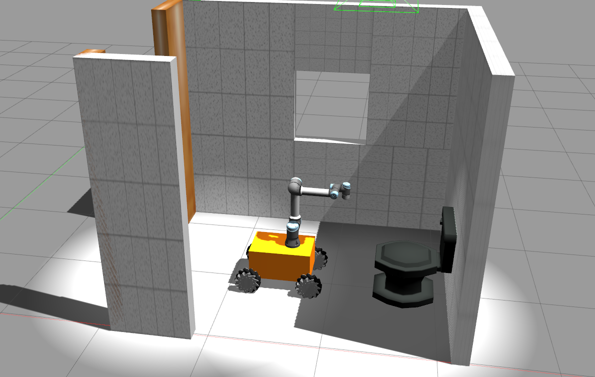

# ROBOT CLEANER ROS PACKAGE
This is robot_cleaner ROS package for demonstration a mobile manipulator cleaning the toilet


## Moveit
This is robot_cleaner ROS package for demonstration a mobile manipulator cleaning the toilet


## 1. Install ROS packages
-  Install gazebo_mecanum_plugins: https://github.com/qaz9517532846/gazebo_mecanum_plugins
- Install universal_robot simulation package: https://github.com/ros-industrial/universal_robot
- Install Descartes Motion planning: https://github.com/PickNikRobotics/descartes_capability
- Install teleop keyboard 
```
sudo apt-get install ros-$ROS_DISTRO-teleop-twist-keyboard
```

- Install robot_cleaner
```
cd catkin_ws/src
git clone https://github.com/robotlabvn/robot_cleaner
catkin build
```

## 2. Running 
```
roslaunch robot_cleaner spawn_ur5e_cleaner.launch
rosrun teleop_twist_keyboard teleop_twist_keyboard.py 
roslaunch robot_cleaner moveit_planning_execution.launch sim:=true
roslaunch robot_cleaner moveit_rviz.launch
# Move robot base
rosrun robot_cleaner move.py
# Move robot arm
rosrun robot_cleaner move_group_cpp
```

