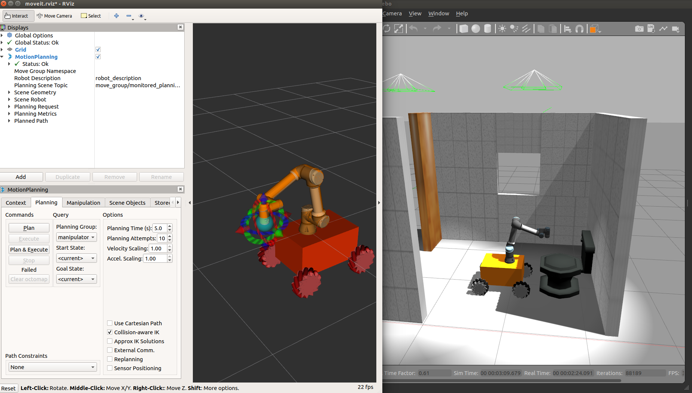

# ROBOT CLEANER ROS PACKAGE

This is ``robot_cleaner`` ROS package for demonstration a mobile manipulator cleaning the toilet.

Demonstrate the development of the system with a ROS project and Gazebo for an Autonomous mobile manipulator robot arm, with the ability to generate appropriate paths for the robot arm, and tap onto external resources if necessary to achieve the outcome.
Project have done the steps below:
- Install ROS: Install ROS (Robot Operating System) on your system. You can visit the official ROS website at ros.org for installation instructions. - [x] Done
- Set up Gazebo: Gazebo is a well-known open-source robotics simulator. You can install Gazebo by following the instructions on the Gazebo website. - [x] Done
- Create a ROS Package: Use the catkin_create_pkg command to create a new ROS package. This package will contain all the necessary files for your project. - [x] Done
Write ROS Nodes: Write ROS nodes to control the autonomous mobile manipulator robot arm. You can use the ROS client library to communicate with the robot arm and send it commands. - [x] Done
- Use Gazebo for Simulation: Use Gazebo to simulate the robot arm and test your ROS nodes. Gazebo allows you to create a virtual environment for your robot arm and test its behavior in different scenarios. - [x] Done
- Use ROS Planners: Use ROS motion planning OMPL libraries,, to generate appropriate paths for the robot arm. MoveIt provides tools for motion planning, kinematics. - [x] Done
- Tap into External Resources that you can use in your project. - [x] Done


## Moveit
MoveIt is a widely used motion planning framework for the ROS (Robot Operating System) software. There are tutorials and resources available for setting up MoveIt with UR5e robots, which involve launching MoveIt nodes for motion planning and RViz for visualization.


## 1. Install ROS packages
-  Install gazebo_mecanum_plugins: https://github.com/qaz9517532846/gazebo_mecanum_plugins
- Install universal_robot simulation package: https://github.com/ros-industrial/universal_robot
- Install Descartes Motion planning: https://github.com/PickNikRobotics/descartes_capability
- Install teleop keyboard 
```
sudo apt-get install ros-$ROS_DISTRO-teleop-twist-keyboard
```

- Install robot_cleaner
```
cd catkin_ws/src
git clone https://github.com/robotlabvn/robot_cleaner
catkin build
```

## 2. Running 
```
roslaunch robot_cleaner spawn_ur5e_cleaner.launch
rosrun teleop_twist_keyboard teleop_twist_keyboard.py 
roslaunch robot_cleaner moveit_planning_execution.launch sim:=true
roslaunch robot_cleaner moveit_rviz.launch
# Move robot base
rosrun robot_cleaner move.py
# Move robot arm
rosrun robot_cleaner move_group_cpp
```

